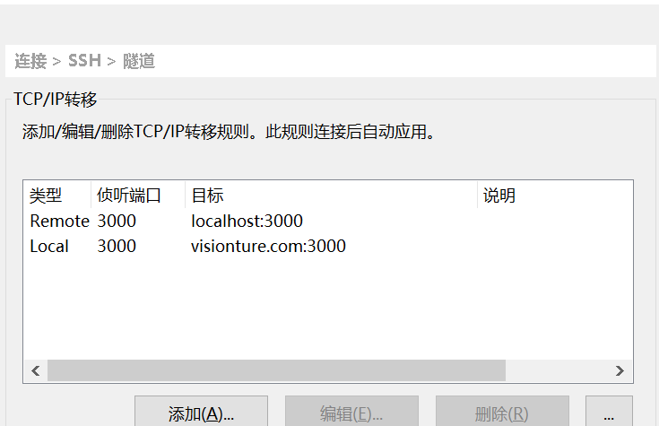

## 安装nginx 
__ubuntu 18.04__

- sudo apt install nginx
- sudo ufw app list
- sudo ufw app list
- sudo ufw allow 'Nginx HTTP'
- sudo ufw status
- systemctl status nginx
```
  ....
    server {
    listen 80;
    server_name www.**.abc.com;
    location / {
        proxy_set_header X-Real-IP $remote_addr;
        proxy_set_header Host $http_host;
        proxy_pass https://127.0.0.1:443;
    }
}
 
   ....

```
- 验证 重启  
*nginx -t nginx -s reload*  
打开服务器上 /etc/sshd/config gateway端口

=============================================
## Xshell 配置 转发

- 

